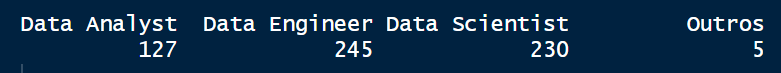
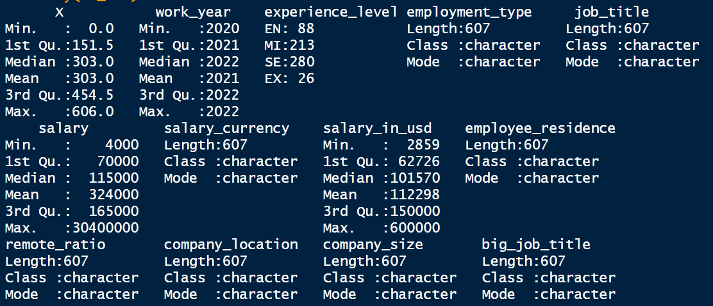
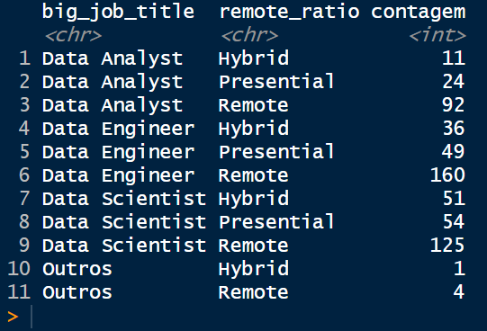
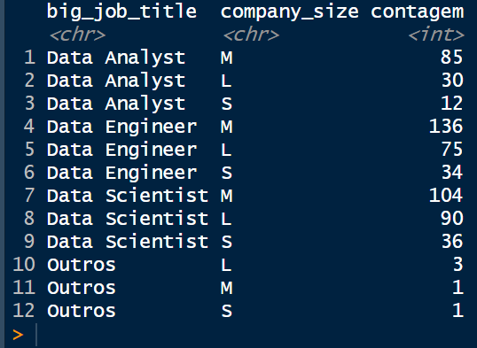

# Salários para posições na área de dados 

Este script foi criado por [Jonas Arjona](https://www.linkedin.com/in/jonas-arjona-639497190/). Nele desenvolvemos uma análise de dados para os salários de posições relacionadas com Análise, Ciência e Engenharia de Dados a partir dos dados disponiblizados por [Ruchi Bhatia na plataforma Kaggle](https://www.kaggle.com/datasets/ruchi798/data-science-job-salaries). Eles foram extraídos por este do site [AI-Jobs](https://ai-jobs.net/). Seu uso e reprodução é de domínio público. 

## Primeiro passo: a pergunta de pesquisa
A fonte de dados em questão possui informações sobre características de vagas para posições relacionadas a dados, como possibilidade de trabalho remoto, tipo de vínculo empregaticio ou nível de experiência desejada do candidato.

Logo, nossa pergunta de pesquisa foi: 

**As vagas para carreiras em dados sofrem influências significativas das escolhas feitas pelos recrutadores no processo de contratação?**

Como perguntas auxiliares temos algumas delas:
* A perspectiva de trabalho remoto reduz a compensação salarial?
* A experiência é a mais influente variável na definição do salário?
* Há algum tipo de contratação dominante nesse ramo?

## Segundo passo: os dados e suas fontes
Nosso banco consiste em informações extraídos de um site de anúncio de vagas e possui:
* **X**: o id de cada vaga;
* **work_year**: Ano da públicação da vaga (2020,2021 ou 2022);
* **experienca_level**: experiência desejada ("EN" para entrada, "MI" para júnior, "SE" para sênior e "EX" para diretor);
* **employment_type**: tipo de contratração ("PT" para meio-período,"FT" para integral, "CT" para contrato e "FL" para freelance); 
* **job_title**: título do cargo;
* **salary**: salário;
* **salary_currency**: moeda do salário;
* **salary_in_usd**: salário em dólares;
* **employee_residence**: residência do contratado;
* **remote_ratio**: modalidade de trabalho remot0 ("0" para presencial, "50" para híbrido e "100" para remoto);
* **company_location**: país da empresa;
* **company_size**: tamanho da empresa ("S" para -50 empregados,"M" entre 50 e 250 e "L" para +250).

Primeiro, selecionamos nosso **working directory**, os pacotes a serem usados e desabilitamos a função automática de notação científica. 

```r
#WORKING DIRECTORY 
setwd([DIRETÓRIO DE SUA ESCOLHA])
getwd()

#PACOTES
library(tidyverse)
library(ggplot2)

#OPTIONS
options(scipen = 999)
```

Em seguida, abrimos nosso arquivo **.csv** contendo nossos dados e o associamos a um objeto chamado **ds_sal**. A base contém o nome das variáveis no topo e valores separados por vírgula. Usamos o argumetno **dec** para definir o ponto final como divisor decimal.

```r
ds_sal <- read.csv("ds_salaries.csv",sep=",",dec=".",header = T)
```

Usamos a função **nrow** para obtermos o tamanho do nosso banco, isto é, quantas vagas estão contidas nele. Além disso, executamos um **unique** para **job_title** onde obtemos a relação dos cargos contidos na base. Por fim, rodamos **group_by** junto com um **summarise** para obter número de vagas para cada um deles organizado de forma decrescente. Como temos muitos cargos, pedimos apenas os 10 primeiros cargos.

```r
nrow(ds_sal)
```


```r
unique(ds_sal$job_title)
```


```r
ds_sal %>% 
  group_by(job_title) %>% 
  summarise(contagem=n()) %>%
  arrange(desc(contagem))
```


Conforme observamos, os 607 pontos de dados apresentam 49 cargos diferentes, com alguns poucos deles ultrapassando a casa das dez vagas. Olhando nosso **group_by** podemos constatamos que essa variabilidade pode advir dos vários nomes dados para funções semelhantes: Data Scientist, Data Science Manager, Data Architect, Data Enginner, entre outros. Por isso, parte do esforço analítico deve ser reduzir a variabilidade, seja filtrando por um grupo específico de cargos parecidos, seja recategorizando-os.

Primeiro, partimos de um entendimendo basilar sobre as diferenças entre o Cientista de Dados, o Analista de Dados e o Engenheiro de Dados. Usamos a descrição anedótica ofericida pelo engenheiro de dados [James Ho](https://towardsdatascience.com/data-scientist-vs-data-analyst-vs-data-engineer-1e2514a36d41). As três ocupações consomem dados, mas de formas diferentes e propósitos distintos. 

O Analista de Dados usa dos seus conhecimentos em linguagens de programação e do setor específico em atuação para descrever o agora com base nos dados disponíveis. Gerando visualizações e relatórios, seu trabalho oferecer para diferentes grupos de pessoas informações e insights sobre a atuação geral da empresa a fim de facilitar a tomada de decisão baseada em dados (_data-driven analysis_).

O Cientista de Dados, por outro lado, foca em gerar análises preditivas, muitas vezes empregando técnicas estatísticas, aprendizado de máquina e  inteligência artificial. Ele não está interessado no diálogo do Analista com outras partes da empresa, mas sim em procurar e confirmar padrões futuros.

Por fim, o Engenheiro de Dados é responsável por estruturar os dados a serem usados pelos dois cargos anteriores. As fontes de dados são as mais variadas, bem como seus formatos, devendo o Engenheiro de Dados processar e organizar os dados gerados. Seu trabalho consiste em gerar _pipelines_, um processo de extração-transformação-carregamento, que criarão o material tanto para o Analista quanto para o Cientista.

Assim, poderíamos distinguir os cargos e recodificá-los com base nessas três funções, usando eventualmente de uma categoria residual para armazenar os casos não tão evidentes. Alguns casos misturam os cargos, como Data Science Engineer, o que dificulta a distinção. Abaixo temos todas as linhas de código responsáveis pela recategorização, a tabela com os novos e velhos valores e o **mutate**. Por fim, pedimos um **table** para avaliar como ficou nossa nova variável **big_job_title**

```r
DA <- c('Product Data Analyst','Data Analyst','Business Data Analyst',
        'Lead Data Analyst','BI Data Analyst','Marketing Data Analyst',
        'Financial Data Analyst','Data Analytics Manager',
        'Finance Data Analyst','Principal Data Analyst',
        'Data Analytics Lead')

DS <- c('Data Scientist','Machine Learning Scientist','Data Science Consultant',
        'Director of Data Science','Research Scientist','Machine Learning Manager',
        'AI Scientist','Data Science Manager','3D Computer Vision Researcher',
        'Applied Data Scientist','Machine Learning Developer',
        'Applied Machine Learning Scientist','Head of Data Science',
        'Staff Data Scientist','Head of Machine Learning','Lead Data Scientist',
        'Principal Data Scientist')

DE <- c('Big Data Engineer','Machine Learning Engineer','Lead Data Engineer',
        'Data Engineer','Data Engineering Manager','Machine Learning Infrastructure Engineer',
        'ML Engineer','Computer Vision Engineer','Data Analytics Engineer','Cloud Data Engineer',
        'Computer Vision Software Engineer','Director of Data Engineering',
        'Data Science Engineer','Principal Data Engineer','Data Specialist',
        'Data Architect','Big Data Architect','Analytics Engineer','ETL Developer',
        'NLP Engineer','Lead Machine Learning Engineer')

ds_sal <- ds_sal %>% 
  mutate(big_job_title=case_when(
    job_title %in% DA~"Data Analyst",
    job_title %in% DS~"Data Scientist",
    job_title %in% DE~"Data Engineer",
    TRUE~"Outros"
  ))

```


```r
table(ds_sal$big_job_title)
```



Outro passo dado é o de limpeza e reorganização de algumas variáveis de tipo **factor**. A medição da experiência é claramente um **factor** ordinal, onde cada valor indica mais conhecimento que o anterior. Abaixo temos a recodificação e um **table** dela.

```r
ds_sal$experience_level <- factor(ds_sal$experience_level,
                                  levels=c("EN","MI","SE","EX"))

table(ds_sal$big_job_title)
```


A proporção de trabalho remoto é armazenada como número, apesar de ser também uma categoria com ordenamento prévio. Usamos de um **mutate** com um **case_when** para gerar os valores desejados: "Non-remote" para 0, "Hybrid" para 50 e "Remote" para 100. Também temos um **table**.

```r
ds_sal <- ds_sal %>% 
  mutate(remote_ratio = case_when(
    remote_ratio == "0" ~ "Non-remote",
    remote_ratio == "50" ~ "Hybrid",
    TRUE ~ "Remote"
  ))

table(ds_sal$remote_ratio)
```


Feitas esses correções, podemos partir para o mergulho exploratório.

## Terceiro passo: o mergulho exploratório

Rodamos primeiro as duas funções **str** e **summary** para olhar os dados de maneira rápido, em especial os quantitativos (ligados aos salários).

```r
str(ds_sal)
```


```r
summary(ds_sal)
```



Conforme observamos, temos majoritariamente variáveis qualitativas nesses nossos dados, sendo apenas salário (original e convertido) números. Assim, nossa análise discutirá as nuances sofridas pelos salários ofertados para diferentes cargos e clivados por características qualitativas das vagas e dos contratados.

No **summary** vemos como há uma considerável variabilidade de salários ao compararmos tanto os valores máximos e mínimos quanto o primeiro e o terceiro quartil (intervalo que contém 50% dos possíveis valores). Como há três grandes grupos de cargos, em três formatos de trabalho diferentes, quatro formatos de contrato e quatro níveis de experiência, não surpreende a amplitude dessa variável.

Podemos observar, de maneira cruzada, quantas vagas há para cada grande categoria de **big_job_title** por experiência e formato de trabalho. Geramos também um gráfico sem as observações de **Head of Data**, um cargo residual da recodificação com poucas unidades.

> Como o objetivo aqui é só nos familiarizarmos com os dados, não nos preocupamos ainda com aspectos estésticos dos gráficos. Faremos isso posteriormente.

```r
ds_sal %>%
  group_by(big_job_title,experience_level) %>%
  summarise(contagem=n()) %>%
  arrange(big_job_title,experience_level,desc(contagem))
```


```r
ds_sal %>%
  filter(big_job_title != "Head of Data") %>% 
  group_by(big_job_title,experience_level) %>%
  summarise(contagem=n()) %>%
  ggplot()+
  geom_col(aes(x=big_job_title,y=contagem,fill=experience_level))
```


Posições relacionadas à engenheria de dados são as mais presentes nos nossos dados, seguidas daquelas focadas em ciência de dados. Isso pode advir tanto de uma maior procura delas quanto de um resultado da nossa recodificação, já que há de fato mais cargos diferentes nesses valores do que em análise de dados.

Além disso, é possível afirmar que as três grandes áreas consideram muito mais candidatos com experiência acima da inicial (MI e SE) do que aqueles que estão começando (EN). Porém, como seria possível ter experiência para se candidatar se há tanta desvalorização dos iniciantes? Para o maior nível de experiência, EX, já eram esperados aquelas proporções já que é um cargo executivo e de alto nível.

Cruzando com formato de trabalho, encontramos uma preferência generalizada pelo formato remoto. Uma vez que as tarefas associadas à área de dados são executadas em computadores e não precisam de algum tipo de aparato específico (como uma máquina, por exemplo), não surpreende essa proporção. Ademais, a variedade dos países (como observados em **company_location**) demonstra ser este um padrão geral da área. A proporção é menor para cargos em análise.

```r
ds_sal %>%
  group_by(big_job_title,remote_ratio) %>%
  summarise(contagem=n()) %>%
  arrange(big_job_title,remote_ratio,desc(contagem))
```



```r
ds_sal %>%
  filter(big_job_title != "Head of Data") %>% 
  group_by(big_job_title,remote_ratio) %>%
  summarise(contagem=n()) %>%
  ggplot()+
  geom_col(aes(x=big_job_title,y=contagem,fill=remote_ratio))
```


Disparado o países que mais possui vagas em dados é os Estado Unidos, ao ponto de ser incomparável procurar padrões de favorecimento de um cargo em um país em detrimento de outra posição.

```r
ds_sal %>%
  filter(big_job_title != "Head of Data") %>% 
  group_by(company_location,big_job_title) %>%
  summarise(contagem=n()) %>%
  ggplot()+
  geom_col(aes(x=reorder(company_location,contagem),y=contagem,fill=big_job_title))+
  coord_flip()
```


O tamanho da companhia razoavelmente subverte as expectativas. São as companhias de tamanho médio (entre 50 e 250 funcionários) as que mais divulgam vagas na área de dados. Era esperado que esse domínio fosse das maiores empresas já que um maior quadro de funcionários refletiria um aumento também na necesidade de pessoal ligado a dados. Essas proporções sofrem inflexões apenas nas posições de cientista e engenheiro de dados para as grandes empresas, apesar dessa mudança não reverter o quadro geral.

```r
ds_sal %>%
  group_by(big_job_title,company_size) %>%
  summarise(contagem=n()) %>%
  arrange(big_job_title,desc(contagem))
```



```r
ds_sal %>%
  filter(big_job_title != "Head of Data") %>% 
  group_by(big_job_title,company_size) %>%
  summarise(contagem=n()) %>%
  ggplot()+
  geom_col(aes(x=big_job_title,y=contagem,fill=company_size))
```


Por fim, temos abaixo alguns dados sobre os salários cruzados por cargo e nível de experiência. A lógica do maior salário para o maior nível de experiência era esperada e foi confirmada, mas é interessante nós entendermos os saltos nesses valores conforme subimos na escala de conhecimento. 

```r
ds_sal %>%
  group_by(big_job_title,experience_level) %>%
  summarise(contagem=n(),
            media=mean(salary_in_usd)) %>%
  arrange(big_job_title,desc(media))
```


```r
ds_sal %>%
  filter(big_job_title != "Head of Data") %>% 
  group_by(big_job_title,experience_level) %>%
  summarise(contagem=n(),
            media=mean(salary_in_usd)) %>% 
  ggplot()+
  geom_col(aes(x=big_job_title,y=media,fill=experience_level),position = "dodge")
```


O iniciante, o júnior e o sênior se encontram mais ou menos com as mesmas médias para os três cargos, sendo apenas na posição de executivo onde há divergência, sendo maior para o engenheiro e menor para o analista. Outro ponto é que o salto entre níveis é muito próximo entre os três primeiros níveis, novamente sendo diferente apenas na posição de executivo. Enquanto o analista executivo vê pouca mudança na sua média salarial (entre 10 e 15 mil), o engenheiro recebe um aumento de 100 mil dólares ao ano e o cientista de 32 mil dólares.

## Quarto passo: a análise em si
