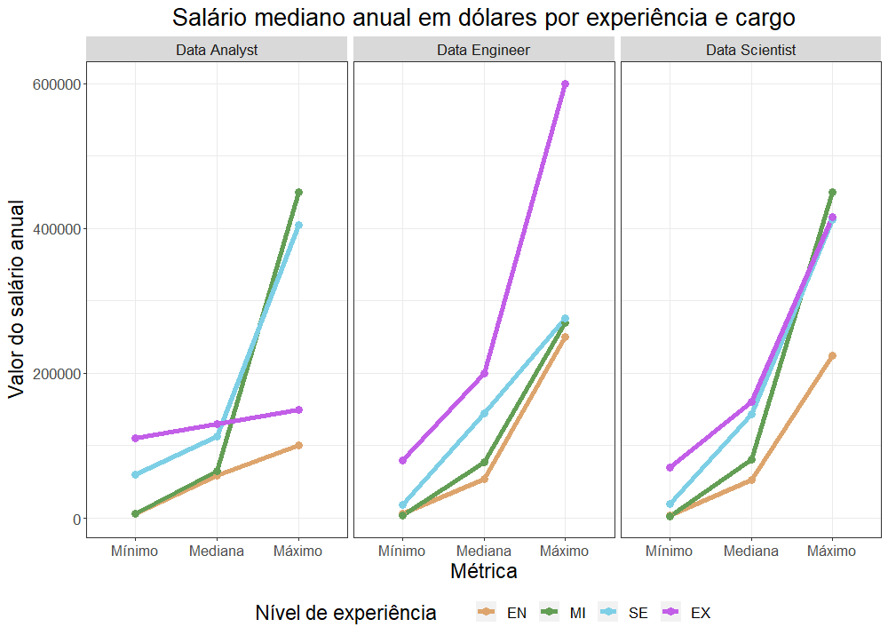
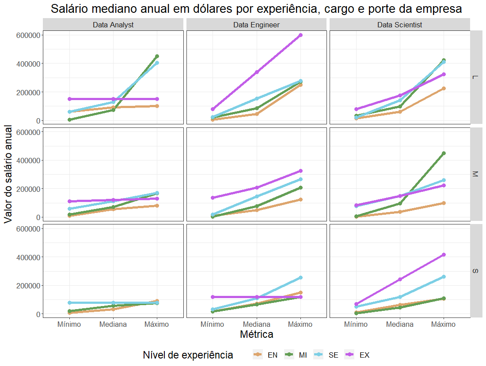

# Salários para posições na área de dados 

Este script foi criado por [Jonas Arjona](https://www.linkedin.com/in/jonas-arjona-639497190/). Nele desenvolvemos uma análise de dados para os salários de posições relacionadas com Análise, Ciência e Engenharia de Dados a partir dos dados disponiblizados por [Ruchi Bhatia na plataforma Kaggle](https://www.kaggle.com/datasets/ruchi798/data-science-job-salaries). Eles foram extraídos por este do site [AI-Jobs](https://ai-jobs.net/). Seu uso e reprodução é de domínio público. 

## Primeiro passo: a pergunta de pesquisa
A fonte de dados em questão possui informações sobre características de vagas para posições relacionadas a dados, como possibilidade de trabalho remoto, tipo de vínculo empregaticio ou nível de experiência desejada do candidato.

Logo, nossa pergunta de pesquisa foi: 

**As vagas para carreiras em dados sofrem influências significativas nas compensações salariais das escolhas feitas pelos recrutadores no processo de contratação?**

Como perguntas auxiliares temos algumas delas:
* A perspectiva de trabalho remoto reduz a compensação salarial?
* A experiência é a mais influente variável na definição do salário?
* Há algum tipo de contratação dominante nesse ramo?

## Segundo passo: os dados e suas fontes
Nosso banco consiste em informações extraídas de um site de anúncio de vagas e possui:
* **X**: o id de cada vaga;
* **work_year**: Ano da públicação da vaga (2020, 2021 ou 2022);
* **experienca_level**: experiência desejada ("EN" para entrada, "MI" para júnior, "SE" para sênior e "EX" para diretor);
* **employment_type**: tipo de contratração ("PT" para meio-período,"FT" para integral, "CT" para contrato e "FL" para freelance); 
* **job_title**: título do cargo;
* **salary**: salário;
* **salary_currency**: moeda do salário;
* **salary_in_usd**: salário em dólares;
* **employee_residence**: residência do contratado;
* **remote_ratio**: modalidade de trabalho ("0" para presencial, "50" para híbrido e "100" para remoto);
* **company_location**: país da empresa;
* **company_size**: tamanho da empresa ("S" para -50 empregados,"M" entre 50 e 250 e "L" para +250).

Primeiro, selecionamos nosso **working directory**, os pacotes a serem usados e desabilitamos a função automática de notação científica. 

```r
#WORKING DIRECTORY 
setwd([DIRETÓRIO DE SUA ESCOLHA])
getwd()

#PACOTES
library(tidyverse)
library(ggplot2)

#OPTIONS
options(scipen = 999)
```

Em seguida, abrimos nosso arquivo **.csv** contendo nossos dados e o associamos a um objeto chamado **ds_sal**. A base contém o nome das variáveis no topo e valores separados por vírgula. Usamos o argumetno **dec** para definir o ponto final como divisor decimal.

```r
ds_sal <- read.csv("ds_salaries.csv",sep=",",dec=".",header = T)
```

Usamos a função **nrow** para obtermos o tamanho do nosso banco, isto é, quantas vagas estão contidas nele. Além disso, executamos um **unique** para **job_title** onde obtemos a relação dos cargos contidos na base. Por fim, rodamos **group_by** junto com um **summarise** para obter número de vagas para cada um deles organizado de forma decrescente. Como temos muitos cargos, pedimos apenas os 10 primeiros cargos.

```r
nrow(ds_sal)
```


```r
unique(ds_sal$job_title)
```


```r
ds_sal %>% 
  group_by(job_title) %>% 
  summarise(contagem=n()) %>%
  arrange(desc(contagem))
```


Conforme observamos, os 607 pontos de dados apresentam 49 cargos diferentes, com alguns poucos deles ultrapassando a casa das dez vagas. Olhando nosso **group_by** podemos constatar que essa variabilidade pode advir dos vários nomes dados para funções semelhantes: Data Scientist, Data Science Manager, Data Architect, Data Enginner, entre outros. Por isso, parte do esforço analítico deve ser reduzir a variabilidade, seja filtrando por um grupo específico de cargos parecidos ou seja recategorizando-os.

Primeiro, partimos de um entendimendo basilar sobre as diferenças entre o Cientista de Dados, o Analista de Dados e o Engenheiro de Dados. Usamos a descrição anedótica ofericida pelo engenheiro de dados [James Ho](https://towardsdatascience.com/data-scientist-vs-data-analyst-vs-data-engineer-1e2514a36d41). As três ocupações consomem dados, mas de formas diferentes e propósitos distintos. 

O Analista de Dados usa dos seus conhecimentos em linguagens de programação e do setor específico em atuação para descrever o agora com base nos dados disponíveis. Gerando visualizações e relatórios, seu trabalho é oferecer para diferentes grupos de pessoas informações e insights sobre a atuação geral da empresa a fim de facilitar a tomada de decisão baseada em dados (_data-driven analysis_).

O Cientista de Dados, por outro lado, foca em gerar análises preditivas, muitas vezes empregando técnicas estatísticas, aprendizado de máquina e  inteligência artificial. Ele não está interessado no diálogo do Analista com outras partes da empresa, mas sim em procurar e confirmar padrões futuros.

Por fim, o Engenheiro de Dados é responsável por estruturar os dados a serem usados pelos dois cargos anteriores. As fontes de dados são as mais variadas, bem como seus formatos, devendo o Engenheiro de Dados processar e organizar os dados gerados. Seu trabalho consiste em gerar _pipelines_, um processo de extração-transformação-carregamento, que criará o material tanto para o Analista quanto para o Cientista.

Assim, poderíamos distinguir os cargos e recodificá-los com base nessas três funções, usando eventualmente de uma categoria residual para armazenar os casos não tão evidentes. Alguns casos misturam os cargos, como Data Science Engineer, o que dificulta a distinção. Abaixo temos todas as linhas de código responsáveis pela recategorização, a tabela com os novos e velhos valores e o **mutate**. Por fim, pedimos um **table** para avaliar como ficou nossa nova variável **big_job_title**

```r
DA <- c('Product Data Analyst','Data Analyst','Business Data Analyst',
        'Lead Data Analyst','BI Data Analyst','Marketing Data Analyst',
        'Financial Data Analyst','Data Analytics Manager',
        'Finance Data Analyst','Principal Data Analyst',
        'Data Analytics Lead')

DS <- c('Data Scientist','Machine Learning Scientist','Data Science Consultant',
        'Director of Data Science','Research Scientist','Machine Learning Manager',
        'AI Scientist','Data Science Manager','3D Computer Vision Researcher',
        'Applied Data Scientist','Machine Learning Developer',
        'Applied Machine Learning Scientist','Head of Data Science',
        'Staff Data Scientist','Head of Machine Learning','Lead Data Scientist',
        'Principal Data Scientist')

DE <- c('Big Data Engineer','Machine Learning Engineer','Lead Data Engineer',
        'Data Engineer','Data Engineering Manager','Machine Learning Infrastructure Engineer',
        'ML Engineer','Computer Vision Engineer','Data Analytics Engineer','Cloud Data Engineer',
        'Computer Vision Software Engineer','Director of Data Engineering',
        'Data Science Engineer','Principal Data Engineer','Data Specialist',
        'Data Architect','Big Data Architect','Analytics Engineer','ETL Developer',
        'NLP Engineer','Lead Machine Learning Engineer')

ds_sal <- ds_sal %>% 
  mutate(big_job_title=case_when(
    job_title %in% DA~"Data Analyst",
    job_title %in% DS~"Data Scientist",
    job_title %in% DE~"Data Engineer",
    TRUE~"Outros"
  ))

```

 

```r
table(ds_sal$big_job_title)
```

 

Outro passo dado é o de limpeza e reorganização de algumas variáveis de tipo **factor**. A medição da experiência é claramente um **factor** ordinal, onde cada valor indica mais conhecimento que o anterior. Abaixo temos a recodificação e um **table** dela.

```r
ds_sal$experience_level <- factor(ds_sal$experience_level,
                                  levels=c("EN","MI","SE","EX"))

table(ds_sal$big_job_title)
```


A proporção de trabalho remoto é armazenada como número, apesar de ser também uma categoria com ordenamento prévio. Usamos de um **mutate** com um **case_when** para gerar os valores desejados: "Non-remote" para 0, "Hybrid" para 50 e "Remote" para 100. Também temos um **table**.

```r
ds_sal <- ds_sal %>% 
  mutate(remote_ratio = case_when(
    remote_ratio == "0" ~ "Presential",
    remote_ratio == "50" ~ "Hybrid",
    TRUE ~ "Remote"
  ))

table(ds_sal$remote_ratio)
```


Feitas essas correções, podemos partir ao mergulho exploratório.

## Terceiro passo: o mergulho exploratório

Rodamos primeiro as duas funções **str** e **summary** para olhar os dados de maneira rápida, em especial os quantitativos (ligados aos salários).

```r
str(ds_sal)
```


```r
summary(ds_sal)
```


Conforme observamos, temos majoritariamente variáveis qualitativas nesses dados, sendo apenas salário (original e convertido) números. Assim, nossa análise discutirá as nuances sofridas pelos salários ofertados para diferentes cargos e clivados por características qualitativas das vagas e dos contratados.

No **summary** vemos como há uma considerável variabilidade de salários ao compararmos tanto os valores máximos e mínimos quanto o primeiro e o terceiro quartil (intervalo que contém 50% dos possíveis valores). Como há três grandes grupos de cargos, em três formatos de trabalho diferentes, quatro formatos de contrato e quatro níveis de experiência, não surpreende a amplitude dessa variável.

Podemos observar, de maneira cruzada, quantas vagas há para cada grande categoria de **big_job_title** por experiência e formato de trabalho. Geramos também um gráfico sem as observações de **Head of Data**, um cargo residual da recodificação com poucas unidades.

> Como o objetivo aqui é só nos familiarizarmos com os dados, não nos preocupamos ainda com aspectos estésticos dos gráficos. Faremos isso posteriormente.

```r
ds_sal %>%
  group_by(big_job_title,experience_level) %>%
  summarise(contagem=n()) %>%
  arrange(big_job_title,experience_level,desc(contagem))
```


```r
ds_sal %>%
  filter(big_job_title != "Outros") %>% 
  group_by(big_job_title,experience_level) %>%
  summarise(contagem=n()) %>%
  ggplot()+
  geom_col(aes(x=big_job_title,y=contagem,fill=experience_level))
```


Posições relacionadas à engenheria de dados são as mais presentes nos nossos dados, seguidas daquelas focadas em ciência de dados. Isso pode advir tanto de uma maior procura delas quanto de um resultado da nossa recodificação, já que há de fato mais cargos diferentes nesses valores do que em análise de dados.

Além disso, é possível afirmar que as três grandes áreas consideram muito mais candidatos com experiência acima da inicial (MI e SE) do que aqueles que estão começando (EN). Porém, como seria possível ter experiência para se candidatar se há tanta desvalorização dos iniciantes? Para o maior nível de experiência, EX, já eram esperados aquelas proporções já que é um cargo executivo e de alto nível.

Cruzando com formato de trabalho, encontramos uma preferência generalizada pelo formato remoto. Uma vez que as tarefas associadas à área de dados são executadas em computadores e não precisam de algum tipo de aparato específico (como uma máquina, por exemplo), não surpreende essa proporção. Ademais, a variedade dos países (como observados em **company_location**) demonstra ser este um padrão geral da área. A proporção é menor para cargos em análise.

```r
ds_sal %>%
  group_by(big_job_title,remote_ratio) %>%
  summarise(contagem=n()) %>%
  arrange(big_job_title,remote_ratio,desc(contagem))
```

 

```r
ds_sal %>%
  filter(big_job_title != "Outros") %>% 
  group_by(big_job_title,remote_ratio) %>%
  summarise(contagem=n()) %>%
  ggplot()+
  geom_col(aes(x=big_job_title,y=contagem,fill=remote_ratio))
```


Disparado o países que mais possui vagas em dados é os Estado Unidos, ao ponto de ser incomparável procurar padrões de favorecimento de um cargo em um país em detrimento de outra posição.

```r
ds_sal %>%
  filter(big_job_title != "Outros") %>% 
  group_by(company_location,big_job_title) %>%
  summarise(contagem=n()) %>%
  ggplot()+
  geom_col(aes(x=reorder(company_location,contagem),y=contagem,fill=big_job_title))+
  coord_flip()
```


O tamanho da companhia razoavelmente subverte as expectativas. São as companhias de tamanho médio (entre 50 e 250 funcionários) as que mais divulgam vagas na área de dados. Era esperado que esse domínio fosse das maiores empresas já que um maior quadro de funcionários refletiria um aumento também na necesidade de pessoal ligado a dados. Essas proporções sofrem inflexões apenas nas posições de cientista e engenheiro de dados para as grandes empresas, apesar dessa mudança não reverter o quadro geral.

```r
ds_sal %>%
  group_by(big_job_title,company_size) %>%
  summarise(contagem=n()) %>%
  arrange(big_job_title,desc(contagem))
```


```r
ds_sal %>%
  filter(big_job_title != "Outros") %>% 
  group_by(big_job_title,company_size) %>%
  summarise(contagem=n()) %>%
  ggplot()+
  geom_col(aes(x=big_job_title,y=contagem,fill=company_size))
```


Podemos ainda observar como os cargos se comportaram nos três períodos coletados. O ano de 2020 apresentou modestas cifras para os três cargos, com maior saliência dos cientistas. Já 2021 e 2022 viu um aumento generalizado na quantidade de vagas, indicando a valorização desses profissionais no pós-pandemia. Esse aumento é proporcionalmente maior para os analistas, seguido dos engenheiros e depois cientistas.

```r
ds_sal$work_year <- factor(ds_sal$work_year,
                           levels=c("2020","2021","2022"))

ds_sal %>%
  group_by(big_job_title,work_year) %>%
  summarise(contagem=n()) %>%
  arrange(big_job_title,desc(contagem))

```


```r
ds_sal %>%
  filter(big_job_title != "Outros") %>% 
  group_by(big_job_title,work_year) %>%
  summarise(contagem=n()) %>%
  ggplot()+
  geom_col(aes(x=big_job_title,y=contagem,fill=work_year),position="dodge")
```


Em seguida, temos abaixo alguns dados sobre os salários cruzados por cargo e nível de experiência. A lógica do maior salário para o maior nível de experiência era esperada e foi confirmada, mas é interessante nós entendermos os saltos nesses valores conforme subimos na escala de conhecimento. 

```r
ds_sal %>%
  group_by(big_job_title,experience_level) %>%
  summarise(contagem=n(),
            media=mean(salary_in_usd)) %>%
  arrange(big_job_title,desc(media))
```

 

```r
ds_sal %>%
  filter(big_job_title != "Outros") %>% 
  group_by(big_job_title,experience_level) %>%
  summarise(contagem=n(),
            media=mean(salary_in_usd)) %>% 
  ggplot()+
  geom_col(aes(x=big_job_title,y=media,fill=experience_level),position = "dodge")
```

 

O iniciante, o júnior e o sênior se encontram mais ou menos com as mesmas medianas para os três cargos, sendo apenas na posição de executivo onde há divergência, maior para o engenheiro e menor para o analista. Outro ponto é que o salto entre níveis é muito próximo entre os três primeiros níveis, novamente sendo diferente apenas na posição de executivo. Enquanto o analista executivo vê pouca mudança na sua mediana salarial (entre 10 e 15 mil), o engenheiro recebe um aumento de 100 mil dólares ao ano e o cientista de 32 mil dólares.

Por fim, observamos os tipos de contratos existentes na nossa base. Como tratado no segundo tópico, há quatro formas diferentes de contratação para cargos na área de dados. Como são as suas distribuições?

```r
ds_sal %>%
  group_by(big_job_title,experience_level) %>%
  summarise(contagem=n(),
            media=mean(salary_in_usd)) %>%
  arrange(big_job_title,desc(media))
```


```r
ds_sal %>%
  filter(big_job_title != "Outros") %>% 
  group_by(big_job_title,employment_type) %>%
  summarise(contagem=n()) %>% 
  ggplot()+
  geom_col(aes(x=big_job_title,y=contagem,fill=reorder(employment_type,contagem)),position = "dodge")+
  theme(legend.position = "bottom")
```


De forma bastante evidente observamos que há o completo domínio modelo modelo "FT" (Full-time ou tempo integral) para os três cargos. Um lugar comum para cargos na área de tecnologia (ao menos no Brasil) são as contratações não-CLT, ou seja, PJ ou Freelancer. Apesar das dificuldades em compararmos contextos, parece que essa área no exterior é mais favorecida em questões trabalhistas.

## Quarto passo: a análise em si
É a partir do múltiplo cruzamento de variáveis que iremos retirar os insights para nossa pergunta de pesquisa. Retomando ela, desejamos saber os efeitos que escolhas feitas pelos recrutadores na elaboração de uma vaga afetam as perspectivas salariais da mesma.
 >Daqui em diante usaremos objetos para armazenar as configurações estétiscas dos nossos gráficos. Criamos também objetos para armazenar as palhetas de cores usadas. Abaixo temos os códigos deles.
 
```r
tema <- theme(plot.title = element_text(hjust=.5,size = 20),
              axis.title = element_text(size = 17.5),
              axis.text = element_text(size = 13),
              legend.title = element_text(size = 17.5),
              legend.text = element_text(size = 13),
              legend.position = "bottom",
              strip.text = element_text(size=13),
              panel.background = element_rect(fill = "white"),
              panel.border = element_rect(fill = NA,color = "grey20"),
              panel.grid = element_line(color = "grey92"))

cores_exp <- scale_color_manual(values = c("#dda56d","#639e55","#7dcfe5","#c25ee8"))

cores_remote <- scale_color_manual(values = c("#e7b962","#5cd08b","#5c73d0"))
```

Usamos um conjunto de **group_by** e **summarise** para criar objetos que contém valores mínimos, medianos e máximos dos salários de nossas vagas. Após isso, convertemos a tabela gerada em formado longo com um **pivot_longer** e plotamos nossos gráficos, com as respectivas métricas no eixo X, o valor no eixo Y e usando cores para diferenças as linhas. A ideia mais geral é perceber como essas métricas se comportam para cada grupo.

```r
rel_exp <- ds_sal %>% 
  filter(big_job_title != "Outros") %>% 
  group_by(experience_level) %>%
  summarise(contagem = n(),
            mediana = median(salary_in_usd),
            minimo = min(salary_in_usd),
            maximo = max(salary_in_usd)) %>% 
  pivot_longer(cols=3:5,
               names_to="medida")

rel_exp$medida <- factor(rel_exp$medida,
                            levels=c("minimo","mediana","maximo"))

ggplot(rel_exp,
       aes(x=medida,
           y=value,
           color=experience_level,
           group=experience_level))+
  geom_line(size=2)+
  geom_point(size=3)+
  scale_x_discrete(labels=c("Mínimo","Mediana","Máximo"))+
  labs(title = "Salário mediano anual em dólares por experiência",
       x = "Métrica",
       y = "Valor do salário anual",
       color = "Nível de experiência")+
  tema+
  cores_exp
```


Nessa primeira imagem reafirmamos a noção de que mais experiência indica melhores perspectivas salariais, já que as quatro barras são ascendentes. Seus valores mínimos são muito próximos, mas respeitam a ordem da experiência, bem como as medianas. 

As diferenças se acentuam no caso dos valores máximos, com os cargos de entrada alcançando um teto bem abaixo dos juniores, seniores e executivos. Além disso, as duas posições intermediárias se cruzam para os valores máximos, indicando que a diferença em experiência poder sofrer alguma diluição.

A seguir executamos um cruzamento semelhante mas dessa vez separando os cargos. Para os analistas, a experiência importa, mas o nível de executivo fica aquém do esperado, com um salário abaixo dos dois níveis intermediários. Para o engenheiro, encontramos a maior das discrepâncias do nível executivo, bem como uma certa indiferença nos outros três níveis. Para o cientista, a situação é bastante semelhante exceto para o nível de entrada, batendo no mesmo teto do gráfico anterior.

```r
rel_exp_cargo<- ds_sal %>% 
  filter(big_job_title != "Outros") %>% 
  group_by(big_job_title,experience_level) %>%
  summarise(contagem = n(),
            mediana = median(salary_in_usd),
            minimo = min(salary_in_usd),
            maximo = max(salary_in_usd)) %>% 
  pivot_longer(cols=4:6,
               names_to="medida")

rel_exp_cargo$medida <- factor(rel_exp_cargo$medida,
                         levels=c("minimo","mediana","maximo"))

ggplot(rel_exp_cargo,
       aes(x=medida,
           y=value,
           color=experience_level,
           group=experience_level))+
  geom_line(size=2)+
  geom_point(size=3)+
  facet_wrap(~big_job_title)+
  scale_x_discrete(labels=c("Mínimo","Mediana","Máximo"))+
  labs(title = "Salário mediano anual em dólares por experiência e cargo",
       x = "Métrica",
       y = "Valor do salário anual",
       color = "Nível de experiência")+
  tema+
  cores_exp
```



Na nossa base temos também uma variável referente ao ano que a vaga foi ofertada. Introduzimos ela no gráfico anterior a fim de apreender de que forma o tempo afetou as disparidades causas pela experiência nos salários por cargo.

```r
rel_exp_cargo_ano<- ds_sal %>% 
  filter(big_job_title != "Outros") %>% 
  group_by(big_job_title,experience_level,work_year) %>%
  summarise(contagem = n(),
            mediana = median(salary_in_usd),
            minimo = min(salary_in_usd),
            maximo = max(salary_in_usd)) %>% 
  pivot_longer(cols=5:7,
               names_to="medida")

rel_exp_cargo_ano$medida <- factor(rel_exp_cargo_ano$medida,
                               levels=c("minimo","mediana","maximo"))

ggplot(rel_exp_cargo_ano,
       aes(x=medida,
           y=value,
           color=experience_level,
           group=experience_level))+
  geom_line(size=2)+
  geom_point(size=3)+
  facet_grid(work_year~big_job_title)+
  scale_x_discrete(labels=c("Mínimo","Mediana","Máximo"))+
  labs(title = "Salário mediano anual em dólares por experiência, cargo e ano",
       x = "Métrica",
       y = "Valor do salário anual",
       color = "Nível de experiência")+
  tema+
  cores_exp
```


Em primeiro lugar, apesar do ano de 2020, o cargo de analista apresenta sentidos mistos dos efeitos da experiência, com casos onde os salários medianos dos níveis intermediários se equiparam aos dos seniores. Os máximos parecem apresentar alguns **outliers**, já que em 2021 e 2022 temos as linhas de juniores e seniores destoando nessa métrica.

Em segundo lugar, para os engenheiros temos padrões mais interessantes. Em 2020, a relação de experiência foi completamente invertida, com os cargos de entrada assumindo a dianteira dos valores máximos e as medianas gerais se equiparando. Em 2021 temos um **outlier** no nível executivo, destoando dos outros níveis que seguem a escala da experiência. Já em 2022, os dados estão mais consistentes de maneira geral.

Em terceiro lugar, para os cientistas apenas o nível de entrada é consistente com o esperado. Os demais se cruzam e revezam nas maiores medianas e valores máximos, até subvertendo a ordem dos níveis de experiência.

Um último conjunto de gráficos cruza experiência, cargo e tamanho da empresa. Nele, encontramos dados mais dispersos e inconsistentes: o tamanho da companhia não afeta de maneira concisa os salários e os níveis de experiência também não (o que faz as linhas se cruzarem de maneira nos gráficos).

```r
rel_exp_cargo_size<- ds_sal %>% 
  filter(big_job_title != "Outros") %>% 
  group_by(big_job_title,experience_level,company_size) %>%
  summarise(contagem = n(),
            mediana = median(salary_in_usd),
            minimo = min(salary_in_usd),
            maximo = max(salary_in_usd)) %>% 
  pivot_longer(cols=5:7,
               names_to="medida")

rel_exp_cargo_size$medida <- factor(rel_exp_cargo_size$medida,
                                            levels=c("minimo","mediana","maximo"))

ggplot(rel_exp_cargo_size,
       aes(x=medida,
           y=value,
           color=experience_level,
           group=experience_level))+
  geom_line(size=2)+
  geom_point(size=3)+
  facet_grid(company_size~big_job_title)+
  scale_x_discrete(labels=c("Mínimo","Mediana","Máximo"))+
  labs(title = "Salário mediano anual em dólares por experiência, cargo e tamanho da empresa",
       x = "Métrica",
       y = "Valor do salário anual",
       color = "Nível de experiência")+
  tema+
  cores_exp
```



Amarrando essa sequências de visualizações, é possível reconhecer que há perspectivas mais vantajosas para cargos mais técnicos, como os de cientista e de engenheiro, do que aqueles mais centrados na exposição, como o de analista. O crescimento dos salários pela experiência neles é mais consistente e previsível, bem como alcança patamares maiores.

Agora partimos para avaliar as diferenças salariais modulando por formato de trabalhado (presencial, híbrido ou remoto). Em decorrência de não ter funcionários trabalhando fisicamente num espaço, as empresas que optam por vagas remotas (ou híbridas) poderiam ofertas compensações salariais melhores, já que teriam reduzido uma parcela significativa do seu custo de operação, a saber, a infraestrutura física. Nossos dados mostram isso?

De início, os valores mínimos são muito próximos, só se diferenciando conforme nos aproximamos da mediana. Os valores máximos, porém, consolidam o domínio do modelo remoto nos maiores salários. Além disso, a ordem dos formatos nos indica que o modelo híbrido é o mais prejudicado.

```r
rel_remote <- ds_sal %>% 
  group_by(remote_ratio) %>%
  summarise(contagem = n(),
            mediana = median(salary_in_usd),
            minimo = min(salary_in_usd),
            maximo = max(salary_in_usd)) %>%
  pivot_longer(cols=3:5,
              names_to="medida")
  
rel_remote$medida <- factor(rel_remote$medida,
                                  levels=c("minimo","mediana","maximo"))

ggplot(rel_remote,
       aes(x=medida,
           y=value,
           color=remote_ratio,
           group=remote_ratio))+
  geom_line(size=2)+
  geom_point(size=3)+
  scale_x_discrete(labels=c("Mínimo","Mediana","Máximo"))+
  labs(title = "Salário mediano anual em dólares por formato de trabalho",
       x = "Métrica",
       y = "Valor do salário anual",
       color = "Formato de trabalho")+
  tema+
  cores_remote
```


A seguir, cruzamos formato com cargo. Ao analista, o padrão geral do gráfico anterior se repete, mas de maneira mais acentuada para o formato remoto, indicando este formato ser o mais proveitoso no quesito salário.

Ao engenheiro, o mesmo cenário se apresenta, porém com uma alavancagem um pouco maior para todos os formatos. Além disso, a vantagem salarial do formato remoto é maximizada e a diferenças entre o híbrido e presencial são reduzidas. 

Ao cientista, vemos uma alavancagem maior ainda e uma semelhança extrema entre os formatos de trabalho, indicando ser este um cargo onde pouco parece importar a vaga ser remota, híbrida ou presencial já que os salários são sempre altos.

```r
rel_remote_cargo <- ds_sal %>% 
  filter(big_job_title != "Outros") %>% 
  group_by(remote_ratio,big_job_title) %>%
  summarise(contagem = n(),
            mediana = median(salary_in_usd),
            minimo = min(salary_in_usd),
            maximo = max(salary_in_usd)) %>%
  pivot_longer(cols=4:6,
               names_to="medida")

rel_remote_cargo$medida <- factor(rel_remote_cargo$medida,
                            levels=c("minimo","mediana","maximo"))

ggplot(rel_remote_cargo,
       aes(x=medida,
           y=value,
           color=remote_ratio,
           group=remote_ratio))+
  geom_line(size=2)+
  geom_point(size=3)+
  facet_wrap(~big_job_title)+
  scale_x_discrete(labels=c("Mínimo","Mediana","Máximo"))+
  labs(title = "Salário mediano anual em dólares por formato de trabalho e cargo",
       x = "Métrica",
       y = "Valor do salário anual",
       color = "Formato de trabalho")+
  tema+
  cores_remote
```


Cruzamos também formato de trabalho e cargo com ano. A pandemia de COVID-19 gerou uma adaptação geral do mercado de trabalho e imaginamos que ela não foi instantânea, vindo a se consolidar de maneira mais tardia. Assim, esperamos encontrar maior inconsistência nos dados de 2020, o momento inicial da adaptação.

```r
rel_remote_cargo_ano <- ds_sal %>% 
  filter(big_job_title != "Outros") %>% 
  group_by(remote_ratio,big_job_title,work_year) %>%
  summarise(contagem = n(),
            mediana = median(salary_in_usd),
            minimo = min(salary_in_usd),
            maximo = max(salary_in_usd)) %>%
  pivot_longer(cols=5:7,
               names_to="medida")

rel_remote_cargo_ano$medida <- factor(rel_remote_cargo_ano$medida,
                                  levels=c("minimo","mediana","maximo"))

ggplot(rel_remote_cargo_ano,
       aes(x=medida,
           y=value,
           color=remote_ratio,
           group=remote_ratio))+
  geom_line(size=2)+
  geom_point(size=3)+
  facet_grid(work_year~big_job_title)+
  scale_x_discrete(labels=c("Mínimo","Mediana","Máximo"))+
  labs(title = "Salário mediano anual em dólares por formato de trabalho, cargo e ano",
       x = "Métrica",
       y = "Valor do salário anual",
       color = "Formato de trabalho")+
  tema+
  cores_remote
```


De fato, 2020 foi um ano atípico. Para o analista, pouca diferença entre os formatos foi observado, com os salários batendo no teto do próprio cargo. Para os engenheiros, a diferença ocorre apenas nos valores máximos aos formatos híbrido e remoto. Para o cientista, os formatos remoto e presencial são muito parecidos em seus valores máximos, destoando dos valores mínimos e medianos.

Já em 2021, o analista corresponde ao padrão do gráfico anteriormente, bem como o engenheiro , divergindo apenas pela alavancagem. O cientista, por outro lado, apresenta um padrão um pouco mais confuso, com vagas híbridas e remotas se sobrepondo acima das vagas presenciais.

Em 2022, encontramos a coeriência dos dados gerais expostos nos gráficos anteriores. São as vagas remotas aquelas que melhor remuneram anualmente para os três cargos, seguidas das presenciais. Algumas diferenças de alavancagem e de distância entre os formatos existem, mas no geral a ordem é sempre a mesma.

Finalmente, cruzamos formato de trabalho, cargo e tamanho da empresa. Os três cargos seguem algum padrão por porte de empresa, sendo ele mais consistente para os analistas e engenheiros, e levemente diferente para os cientistas (em especial nas empresas médias).

```r
rel_remote_cargo_size <- ds_sal %>% 
  filter(big_job_title != "Outros") %>% 
  group_by(remote_ratio,big_job_title,company_size) %>%
  summarise(contagem = n(),
            mediana = median(salary_in_usd),
            minimo = min(salary_in_usd),
            maximo = max(salary_in_usd)) %>%
  pivot_longer(cols=5:7,
               names_to="medida")

rel_remote_cargo_size$medida <- factor(rel_remote_cargo_size$medida,
                                      levels=c("minimo","mediana","maximo"))

ggplot(rel_remote_cargo_size,
       aes(x=medida,
           y=value,
           color=remote_ratio,
           group=remote_ratio))+
  geom_line(size=2)+
  geom_point(size=3)+
  facet_grid(company_size~big_job_title)+
  scale_x_discrete(labels=c("Mínimo","Mediana","Máximo"))+
  labs(title = "Salário mediano anual em dólares por formato de trabalho, cargo e tamanho da empresa",
       x = "Métrica",
       y = "Valor do salário anual",
       color = "Formato de trabalho")+
  tema+
  cores_remote
```

 

## Quinto passo: conclusões e interpretações
Experiência de fato importa, mas em proporções diferentes para cada cargo. Como observado, os ganhos salariais em adquirir mais capacitação são concentrados nos cargos de engenheiro e cientista, onde as tarefas são essencialmente mais técnicas (envolvendo mais estatística e programação). 

Temporalmente falando, o cargo de analista sempre apresentou inconsistência já que é muito mais aberto a funcionários de perfis profissionais mais diversos (já que não requer amplos conhecimentos específicos). Além disso, 2020 foi um ano bastante esporádico para os três cargos.

Se tratando de cargos na área de tecnologia, esperávamos e de fato encontramos maior predominância das vagas remotas, tanto em números quanto em faixa salarial. Passado o período de adaptação de 2020, em 2021 e 2022 temos a consolidação do padrão para os três cargos.

Tamanho da empresa não pareceu oferecer muitos achados consistentes, sendo menos relevante que experiência,formato de trabalho e ano em que a vaga foi ofertada.

No mergulho exploratório descobrimos ainda que as contratações em período integral são as mais comuns para os três cargos, algo que combinado com os dados achados por formato de trabalho indicam que não há perda de benefícios trabalhistas mesmo no formato remoto.

Em suma, neste ramo dominam as vagas remotas em período integral, recebendo compensações maiores que aquelas em outros formatos de trabalho e sendo mais presentes do que outros tipos de contratação. Experiência persiste sendo a melhor forma de observar aumentos de salário, mas há cargos onde essa aumento é mais tímido.

